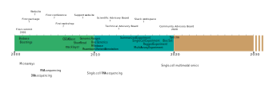
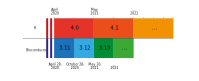
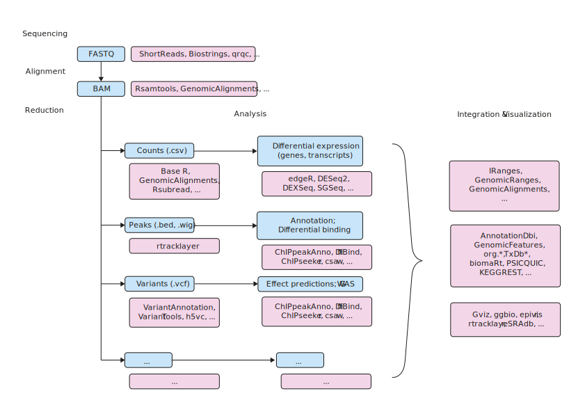

::::::::::::::::::::::::::::::::::::::: objectives

- Describe the Bioconductor project globally.
- Gain a global view of the Bioconductor project in the R ecosystem.
- Identify sources of information to watch for future updates about the Bioconductor project.

::::::::::::::::::::::::::::::::::::::::::::::::::

:::::::::::::::::::::::::::::::::::::::: questions

- What does the Bioconductor project comprise?
- How does the Bioconductor project relate to the CRAN repository?
- How can I learn to use Bioconductor packages effectively?
- How do I join and communicate with the Bioconductor community?

::::::::::::::::::::::::::::::::::::::::::::::::::

## What is Bioconductor?

### A brief history of Bioconductor

The Bioconductor project was started in the Fall of 2001, as an initiative for the collaborative creation of extensible software for computational biology and bioinformatics (Gentleman, Carey, Bates, Bolstad, Dettling, Dudoit, Ellis, Gautier, Ge, Gentry, Hornik, Hothorn, Huber, Iacus, Irizarry, Leisch, Li, Maechler, Rossini, Sawitzki, Smith, Smyth, Tierney, Yang, and Zhang, 2004).
From the very start, the stated mission of the project was to develop tools for the statistical analysis and comprehension of large datasets and technological artifacts in rigorously and robustly designed experiments.
Beyond statistical analyses, the interpretation of statistical results is supported by packages providing biological context, visualization, and reproducibility.

Over the years, software packages contributed to the Bioconductor project have reflected the evolution and emergence of several high-throughput technologies, from microarrays to single-cell genomics, through many variations of sequencing experiments (e.g., RNA-seq, ChIP-seq, DNA-seq), analyses (e.g., sequence variation, copy number variation, single nucleotide polymorphisms), and data modalities (e.g., flow cytometry, proteomics, microscopy and image analysis).

Crucially, the project has not only released software packages implementing novel statistical tests and methodologies, but also produced a diverse range of packages types granting access to databases of molecular annotations and experimental datasets.

The Bioconductor project culminates at an annual conference in North America in the summer, while regional conferences offer great opportunities for networking in Europe, Asia, and North America.
The project is committed to promote a diverse and inclusive community, including a [Code of Conduct][bioc-code-of-conduct] enforced by a Code of Conduct committee.

{alt='Timeline of major Bioconductor milestones alongside technological advancements.'}

**Timeline of major Bioconductor milestones alongside technological advancements.**
Above the timeline, the figure marks the first occurence of major events.
Within the timeline, the name of packages providing core infrastructure indicate the release date.
Below the timeline, major technological advancements contextualise the evolution of the Bioconductor project over time.

### A scientific project

The original publication describes the aims and methods of the project at its inception Gentleman, Carey, Bates et al. (2004).

Huber, Carey, Gentleman, Anders, Carlson, Carvalho, Bravo, Davis, Gatto, Girke, Gottardo, Hahne, Hansen, Irizarry, Lawrence, Love, MacDonald, Obenchain, Oles, Pages, Reyes, Shannon, Smyth, Tenenbaum, Waldron, and Morgan (2015) illustrates the progression of the project, including descriptions of core infrastructure and case studies, from the perspective of both users and developers.

Amezquita, Lun, Becht, Carey, Carpp, Geistlinger, Marini, Rue-Albrecht, Risso, Soneson, Waldron, Pages, Smith, Huber, Morgan, Gottardo, and Hicks (2020) reviewed further developments of the project in the wake of single-cell genomics technologies.

Many more publications and book chapters cite the Bioconductor project, with recent example listed on the [Bioconductor website][bioc-publications].

### A package repository

#### Overview and relationship to CRAN

Undoubtedly, software packages are the best-known aspect of the Bioconductor project.
Since its inception in 2001, the repository has grown over time to host thousands of packages.

The Bioconductor project has extended the preexisting CRAN repository -- much larger and general-purpose in scope -- to comprise R packages primarily catering for bioinformatics and computational biology analyses.

:::::::::::::::::::::::::::::::::::::::::  callout

### Going further

The [Discussion][discuss-cran] article of this lesson includes a section discussing the relationship of Bioconductor and CRAN in further details.

::::::::::::::::::::::::::::::::::::::::::::::::::

#### The Bioconductor release cycle

The Bioconductor project also extended the packaging infrastructure of the CRAN repository to better support the deployment and management of packages at the user level (Gentleman, Carey, Bates et al., 2004).
In particular, the Bioconductor projects features a 6-month release cycle (typically around April and October), which sees a snapshot of the current version of all packages in the Bioconductor repository earmarked for a specific version of R.
R itself is released on an annual basis (typically around April), meaning that for each release of R, two compatible releases of Bioconductor packages are available.

As such, Bioconductor package developers are required to always use the version of R that will be associated with the next release of the Bioconductor project.
This means using the development version of R between October and April, and the release version of R between April and October.

Crucially, the strict Bioconductor release cycle prevents users from installing temporally distant versions of packages that were very likely never tested together.
This practice reflects the development cycle of packages of both CRAN and Bioconductor, where contemporaneous packages are regularly tested by automated systems to ensure that the latest software updates in package dependencies do not break downstream packages, or prompts those package maintainers to update their own software as a consequence.

Prior to each Bioconductor release, packages that do not pass the requires suites of automated tests are deprecated and subsequently removed from the repository.
This ensures that each Bioconductor release provides a suite of packages that are mutually compatible, traceable, and guaranteed to function for the associated version of R.

{alt='Timeline of release dates for selected Bioconductor and R versions.'}

**Timeline of release dates for selected Bioconductor and R versions.**
The upper section of the timeline indicates versions and approximate release dates for the R project.
The lower section of the timeline indicates versions and release dates for the Bioconductor project.
Source: [Bioconductor][bioc-release-dates].

#### Package types

Packages are broadly divided in four major categories:

- software
- annotation data
- experiment data
- workflows

[Software packages][glossary-software-package] themselves can be subdivided into packages that provide infrastructure (i.e., classes) to store and access data,
and packages that provide methodological tools to process data stored in those data structures.
This separation of structure and analysis is at the core of the Bioconductor project,
encouraging developers of new methodological software packages to thoughtfully re-use existing data containers where possible,
and reducing the cognitive burden imposed on users who can more easily experiment with alternative workflows without the need to learn and convert between different data structures.

[Annotation data packages][glossary-annotation-package] provide self-contained databases of diverse genomic annotations (e.g., gene identifiers, biological pathways).
Different collections of annotation packages can be found in the Bioconductor project.
They are identifiable by their respective naming pattern, and the information that they contain.
For instance, the so-called `OrgDb` packages (e.g., the *[org.Hs.eg.db](https://bioconductor.org/packages/3.16/org.Hs.eg.db)* package) provide information mapping different types of gene identifiers and pathway databases;
the so-called `EnsDb` (e.g., *[EnsDb.Hsapiens.v86](https://bioconductor.org/packages/3.16/EnsDb.Hsapiens.v86)*) packages encapsulate individual versions of the Ensembl annotations in Bioconductor packages;
and the so-called `TxDb` packages (e.g., *[TxDb.Hsapiens.UCSC.hg38.knownGene](https://bioconductor.org/packages/3.16/TxDb.Hsapiens.UCSC.hg38.knownGene)*) encapsulate individual versions UCSC gene annotation tables.

[Experiment data packages][glossary-experiment-package] provide self-contained datasets that are often used by software package developers to demonstrate the use of their package on well-known standard datasets in their [package vignettes][glossary-vignette].

Finally, [workflow packages][glossary-workflow-package] exclusively provide collections of vignettes that demonstrate the combined usage of several other packages as a coherent workflow, but do not provide any new source code or functionality themselves.

:::::::::::::::::::::::::::::::::::::::  challenge

### Challenge: The Bioconductor website

The Bioconductor website is accessible at [https://bioconductor.org/](https://bioconductor.org/).

Browse the website to find information answering the following questions:

1. How many packages does the current release of the Bioconductor project include?
2. How many packages of each type does this number include?

:::::::::::::::  solution

### Solution

The following solution includes numbers that were valid at the time of writing (Bioconductor release 3.13);
numbers will inevitably be different for future releases of the Bioconductor project.

1. On the page [https://bioconductor.org/](https://bioconductor.org/), in the section "Install", we can read:

> Discover 2042 software packages available in Bioconductor release 3.13.

2. On the page [https://bioconductor.org/](https://bioconductor.org/), in the section "News", click on the link that reads "Bioconductor Bioc `X.Y` Released" (`X.Y` being the version of the current Bioconductor release when you go through this exercise yourself).
  On the linked page, we can read:

> We are pleased to announce Bioconductor 3.13, consisting of 2042 software packages, 406 experiment data packages, 965 annotation packages, and 29 workflows.
> 
> There are 133 new software packages, 22 new data experiment packages, 7 new annotation packages, 1 new workflow, no new books, and many updates and improvements to existing packages; Bioconductor 3.13 is compatible with R 4.1.0, and is supported on Linux, 32- and 64-bit Windows, and macOS 10.14.6 Mojave or higher. This release will include an updated Bioconductor Docker containers.

:::::::::::::::::::::::::

::::::::::::::::::::::::::::::::::::::::::::::::::

#### Package classification using biocViews

The Bioconductor project uses [biocViews][glossary-biocviews], a set of terms from a controlled vocabulary, to classify Bioconductor packages and facilitate their discovery by thematic search on the [Bioconductor website][biocviews-site].

Each Bioconductor package is tagged with a small set of terms chosen from the available controlled vocabulary, to describe the type and functionality of the package.
Terms are initially selected by the package authors, and subsequently refined during package review or updates to the controlled vocabulary.

:::::::::::::::::::::::::::::::::::::::  challenge

### Challenge

Visit the listing of all packages on the Bioconductor [biocViews][biocviews-site] web page.
Use the "Autocomplete biocViews search" box in the upper left to filter packages by category and explore the graph of software packages by expanding and contracting individual terms.

1. What biocView terms can be used to identify packages that have been tagged for RNA sequencing analysis? ChIP-seq? Epigenetics? Variant annotation? Proteomics? Single-cell genomics?
2. In the `RNASeq` category, two very popular packages are *[DESeq2](https://bioconductor.org/packages/3.16/DESeq2)* and *[edgeR](https://bioconductor.org/packages/3.16/edgeR)*.
  Which one is more popular in terms of download statistics (i.e., lower rank)?

:::::::::::::::  solution

### Solution

1. `RNAseq`, `ChIPSeq`, `Epigenetics`, `VariantAnnotation`, `Proteomics`, `SingleCell`.
2. For Bioconductor release `3.14`, *[DESeq2](https://bioconductor.org/packages/3.16/DESeq2)* and *[edgeR](https://bioconductor.org/packages/3.16/edgeR)* are listed at ranks 23 and 28 respectively.
  In other words, the two packages are among the most frequently downloaded packages in the Bioconductor project, in this instance with a small advantage in favour of *[edgeR](https://bioconductor.org/packages/3.16/edgeR)*.
  
  

:::::::::::::::::::::::::

::::::::::::::::::::::::::::::::::::::::::::::::::

:::::::::::::::::::::::::::::::::::::::::  callout

### Going further

The Bioconductor package *[biocViews](https://bioconductor.org/packages/3.16/biocViews)* is used to support and manage the infrastructure of the controlled vocabulary.
It can also be used to programmatically inspect and subset the list of terms available using their relationship as a graph.

Furthermore, the *[BiocPkgTools](https://bioconductor.org/packages/3.16/BiocPkgTools)* package can be used to browse packages under different [biocViews][glossary-biocviews] ( Su, Carey, Shepherd, Ritchie, Morgan, and Davis, 2019).

::::::::::::::::::::::::::::::::::::::::::::::::::

#### Packages interoperability

At the core of the Bioconductor philosophy is the notion of interoperability.
Namely, the capacity of packages to operate on the same data structures.
Importantly, interoperability benefits both users and developers.

Users can more easily write arbitrarily complex workflows that combine multiple packages.
With packages operating on the same data structure, users can maximize their attention to the practical steps of their workflow, and minimize time spent in often complex and error-prone conversions between different data structures specific to each package.
Comparative benchmarks are also easier to implement and can be evaluated more fairly
when competing software packages offering similar functionality operate on input and outputs stored in the same data structures.

Similarly, developers of new packages can focus on the implementation of novel functionality, borrowing existing data structures that offer robust and trusted infrastructure for storage, verification, and indexing of information.

Ultimately, the figure below illustrates how many different Bioconductor packages - as well as base R packages - can be combined to carry out a diverse range of analyses, from importing sequencing data into an R session, to the annotation, integration and visualization of data and results.

{alt='Sequencing Ecosystem.'}

**Sequencing Ecosystem**
Major data processing steps (blue) and relevant software packages (pink) are listed in the context  of archetypal workflows for various types of genomics analyses.
The sequential relation of workflow steps and software package illustrates the importance of interoperability between software package in order to assemble complete end-to-end workflows.

### Conferences, courses and workshops

The Bioconductor community regularly organizes a number of events throughout the year and across the world. For example:

- The annual BioC summer conference in North America
- Regional conference in winter (e.g. BioC Europe, BioC Asia)
- Summer schools (e.g., CSAMA)
- Online meetings open to all community members (e.g., Bioconductor Developers Forum)

Course materials are regularly uploaded on the [Bioconductor website][bioc-course-materials] following each of those events.
In particular, [online books][bioc-books] are being developed and maintained by community members.

The Bioconductor [YouTube channel][bioc-youtube] is used to publish video recordings of conference presentations including talks and workshops, as well as editions of the regular Bioconductor developers forum (link needed).

:::::::::::::::::::::::::::::::::::::::::  callout

### Contribute!

It could be great to illustrate a typical cycle of conferences over a year, e.g.

- BioC conference in North America around late July
- EuroBioC conference in Europe around December
- BioCAsia conference in Asia around November
  

::::::::::::::::::::::::::::::::::::::::::::::::::

### Online communication channels

#### Support site

The Bioconductor [support site][bioc-support-site] provides a platform where users and developers can communicate freely (following the Bioconductor [Code of Conduct][bioc-code-of-conduct]) to discuss issues on a range of subjects, ranging from packages to conceptual questions about best practices.

#### Slack workspace

The Bioconductor [Slack workspace][bioc-slack] is an open space that all community members are welcome to join (for free) and use for rapid interactions.
Currently, the "Pro" pricing plan kindly supported by core funding provides:

- Unlimited message archive
- Unlimited apps
- Group video calls with screen sharing
- Work securely with other organizations using Slack Connect

A wide range of channels have been created to discuss a range of subjects, and community members can freely join the discussion on those channels of create new ones to discuss new subjects.

Important announcements are posted on the `#general` channel.

:::::::::::::::::::::::::::::::::::::::::  callout

### Note

Users are encouraged to use the Bioconductor [support site][bioc-support-site] to raise issues that are relevant to the wider community.
The Slack workspace is often most useful for live discussions, and widely subscribed channels (e.g. `#general`) should be used with moderation.

::::::::::::::::::::::::::::::::::::::::::::::::::

#### Developer Mailing List

The [bioc-devel@r-project.org](mailto:bioc-devel@r-project.org) mailing list is used for communication between package developers, and announcements from the Biocondutor core team.

### A scientific and technical community

- [Scientific Advisory Board (SAB)][bioc-scientific-advisory-board] Meet Annually, External and Internal leader in the field who act as project advisors. No Term limits.
- [Technical Advisory Board (TAB)][bioc-technical-advisory-board]. Meet monthly to consider technical aspects of core infastructure and scientific direction of the project. 15 members, 3 year term. Annual open-to-all elections to rotate members. Current officers are Vince Carey (chair), Levi Waldron (vice Chair) Charlotte Soneson (Secretary).
- [Community Advisory Board (CAB)][bioc-community-advisory-board] Meet monthly to consider community outreach, events, education and training. 15 members, 3 year term. Annual open-to-all elections to rotate members. Current officers are Aedin Culhane (chair), Matt Ritchie (co Chair), Lori Kern (Secretary).
- [Code of Conduct committee][bioc-code-of-conduct]

:::::::::::::::::::::::::::::::::::::::::  callout

### Note

At least 1 member of TAB/CAB sits on both to act at the liason to ensure communication of the board.

::::::::::::::::::::::::::::::::::::::::::::::::::

## References

[1] S.  Su, V. Carey, L. Shepherd, et al. "BiocPkgTools: Toolkit for
mining the Bioconductor package ecosystem [version 1; peer review: 2
approved, 1 approved with reservations] ". In: _F1000Research_ 8.752
(2019). DOI: 10.12688/f1000research.19410.1.

[2] R. A. Amezquita, A. T. L. Lun, E. Becht, et al. "Orchestrating
single-cell analysis with Bioconductor". In: _Nat Methods_ 17.2 (2020),
pp. 137-145. ISSN: 1548-7105 (Electronic) 1548-7091 (Linking). DOI:
10.1038/s41592-019-0654-x.
<https://www.ncbi.nlm.nih.gov/pubmed/31792435>.

[3] R. C. Gentleman, V. J. Carey, D. M. Bates, et al. "Bioconductor:
open software development for computational biology and
bioinformatics". In: _Genome Biol_ 5.10 (2004), p. R80. ISSN: 1474-760X
(Electronic) 1474-7596 (Linking). DOI: 10.1186/gb-2004-5-10-r80.
<https://www.ncbi.nlm.nih.gov/pubmed/15461798>.

[4] W. Huber, V. J. Carey, R. Gentleman, et al. "Orchestrating
high-throughput genomic analysis with Bioconductor". In: _Nat Methods_
12.2 (2015), pp. 115-21. ISSN: 1548-7105 (Electronic) 1548-7091
(Linking). DOI: 10.1038/nmeth.3252.
<https://www.ncbi.nlm.nih.gov/pubmed/25633503>.

[bioc-code-of-conduct]: https://www.bioconductor.org/about/code-of-conduct/
[bioc-publications]: https://www.bioconductor.org/help/publications/
[discuss-cran]: discuss.html#bioconductor-and-CRAN
[bioc-release-dates]: https://bioconductor.org/about/release-announcements/
[glossary-software-package]: reference.html#software-package
[glossary-annotation-package]: reference.html#annotationdata-package
[glossary-experiment-package]: reference.html#experimentdata-package
[glossary-vignette]: reference.html#vignette
[glossary-workflow-package]: reference.html#workflow-package
[glossary-biocviews]: reference.html#biocviews
[biocviews-site]: https://www.bioconductor.org/packages/release/BiocViews.html
[bioc-course-materials]: https://bioconductor.org/help/course-materials/
[bioc-books]: https://www.bioconductor.org/books/release/
[bioc-youtube]: https://www.youtube.com/user/bioconductor
[bioc-support-site]: https://support.bioconductor.org/
[bioc-slack]: https://bioc-community.herokuapp.com/
[bioc-scientific-advisory-board]: https://bioconductor.org/about/scientific-advisory-board/
[bioc-technical-advisory-board]: https://bioconductor.org/about/technical-advisory-board/
[bioc-community-advisory-board]: https://bioconductor.org/about/community-advisory-board/

:::::::::::::::::::::::::::::::::::::::: keypoints

- R packages are but one aspect of the Bioconductor project.
- The Bioconductor project extends and complements the CRAN repository.
- Different types of packages provide not only software, but also annotations, experimental data, and demonstrate the use of multiple packages in integrated workflows.
- Interoperability beteen Bioconductor packages facilitates the writing of integrated workflows and minimizes the cognitive burden on users.
- Educational materials from courses and conferences are archived and accessible on the Bioconductor website and YouTube channel.
- Different channels of communication enable community members to converse and help each other, both as users and package developers.
- The Bioconductor project is governed by scientific, technical, and advisory boards, as well as a Code of Conduct committee.

::::::::::::::::::::::::::::::::::::::::::::::::::

