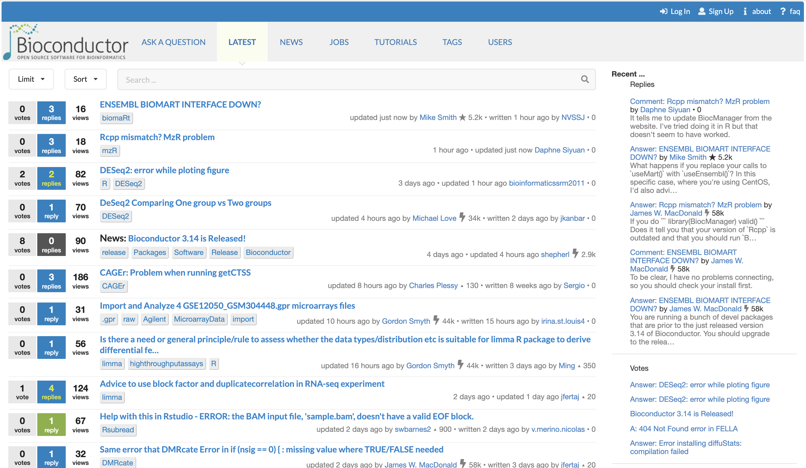

::::::::::::::::::::::::::::::::::::::: objectives

- Identify online resources for help.
- Access package documentation.

::::::::::::::::::::::::::::::::::::::::::::::::::

:::::::::::::::::::::::::::::::::::::::: questions

- Where can I find help online?
- Where can I ask questions to package developers and other users?
- Where can I find documentation for a specific package?
- Where can I learn best practices to combine multiple package into a coherent workflow?

::::::::::::::::::::::::::::::::::::::::::::::::::

## Getting help with Bioconductor packages

Help about Bioconductor packages and best practices is available in several places.
Often, the best source of help depends on the situation at hand:

- Are you trying to identify the best package for a particular task?
- Are you trying to use a package for the very first time?
- Are you unsure about best practices to use and combine multiple packages and functions in a sensible workflow for a particular type of analysis?
- Is a function throwing an error when you apply it to your data?
- Do you have questions about the theory or methodology implemented in a particular package or function?

In the next sections, we describe different sources of help available to Bioconductor users, and situations where each of them are most useful.

## The Bioconductor website

The main [Bioconductor website][bioc-website] provides a host of resources, all freely available without even the need to install R or any Bioconductor package.

In particular, the [biocViews][biocviews-site] page is a great way to thematically explore the collection of packages and identify Bioconductor packages providing a certain functionality.

Furthermore, the website also collects materials from [courses and conferences][bioc-courses-conferences-materials], including presentations, video recordings, and teaching materials.

By nature, individual presentations and training materials are often tied to a specific version of Bioconductor packages.
As such, they provide a snapshot of best practices at a particular point in time, and may become outdated over time after successive Bioconductor releases.
Thus, it is important check the version of packages demonstrated in teaching materials matches that in the user's R library.
Alternatively, when referring to materials that employ package versions different from those in the user's library, it is important to carefully interpret any discrepancy between the expected and actual results.

## Package landing pages

Each package accepted in the Bioconductor project is granted a landing page on the main Bioconductor website, e.g. *[S4Vectors](https://bioconductor.org/packages/3.16/S4Vectors)*.

Package landing pages contains useful information that can be consulted without the need to install the package itself.
This is particularly useful while browsing the Bioconductor repository is search of packages suitable for a specific task.

On the landing page, prospective users can find a short description of the package functionality, as well as pre-compiled documentation in the form of links to [package vignettes][glossary-vignette].
Vignettes represent a particularly powerful form of documentation as they allow package developers to demonstrate the functionality of their package in the context of an example data set and workflow (sometimes more than one).

In particular, precompiled vignettes available on the Bioconductor website provide that information without the need to install the package itself.
Instead, prospective users are presented with documents (PDF or HTML) written by developers to demonstrate how the functions available in the package are meant to be used and combined into a complete workflow.
Often, vignettes use standard data sets preprocessed and freely available from public repositories, including [ExperimentData][glossary-experiment-package] packages or the Bioconductor *[ExperimentHub](https://bioconductor.org/packages/3.16/ExperimentHub)*.

In the "Details" section of the landing page, many packages provide a field labelled "BugReports".
That field provides a URL that users can visit to report bugs to the package developer(s).

:::::::::::::::::::::::::::::::::::::::::  callout

### Note

It can be difficult to distinguish actual software bugs from unwitting mistakes made by users not fully familiar with the package yet.
Later in this episode, we provide advice for reporting bugs and including sufficient information to receive the fastest and most helpful responses.

In doubt, the [Biocondutor support site][bioc-support-site] can also be a great place to discuss individual experiences and share knowledge about packages and best practices.


::::::::::::::::::::::::::::::::::::::::::::::::::

Additionally, the landing page provides many other pieces of information, from daily build reports indicating whether the package passed all tests on a range of operating systems, to software dependencies indicating the number of other Bioconductor packages that must be installed before the package itself can be installed and used on the user's system.

:::::::::::::::::::::::::::::::::::::::::  callout

### Going further

Each package has a landing page for each release of Bioconductor since the package was added to the repository, e.g.:

- [https://www.bioconductor.org/packages/3.14/bioc/html/BiocVersion.html](https://www.bioconductor.org/packages/3.14/bioc/html/BiocVersion.html)
- [https://www.bioconductor.org/packages/3.13/bioc/html/BiocVersion.html](https://www.bioconductor.org/packages/3.13/bioc/html/BiocVersion.html)
- [https://www.bioconductor.org/packages/3.12/bioc/html/BiocVersion.html](https://www.bioconductor.org/packages/3.12/bioc/html/BiocVersion.html)

In the URL of a package landing page, we can replace the version number by the word "release" or "devel" to access the landing page of the latest stable release or development version, respectively.

- [https://www.bioconductor.org/packages/release/bioc/html/BiocPkgTools.html](https://www.bioconductor.org/packages/release/bioc/html/BiocPkgTools.html)
- [https://www.bioconductor.org/packages/devel/bioc/html/BiocPkgTools.html](https://www.bioconductor.org/packages/devel/bioc/html/BiocPkgTools.html)
  

::::::::::::::::::::::::::::::::::::::::::::::::::

## Package vignettes

Each Bioconductor package is required to include at least one vignette.
Many packages have more than one vignette, often separating core functionality from specific use cases.

As we noted earlier in this episode, vignettes are available from [package landing pages][self-package-landing-page] on the Bioconductor website.
However, the landing page only links to the documentation of the most recent version of the package for each version of Bioconductor.
This may be a different version from the one that is installed in the user's R library and used in the R session.

When Bioconductor packages are installed in the user's R library, the vignettes associated with that particular version of the package are also installed on the user's computer.
Those locally installed vignettes are the gold standard reference for the version of the package that is currently installed in the R library and used in the R session.
They can be accessed using the function `browseVignettes()`, for instance:


```r
browseVignettes("BiocManager")
```

Specifically, the function `browseVignettes()` opens a local web page in the user's default web browser, listing all the vignettes available for the requested package.
Each vignette is available in three formats:

- precompiled, in PDF or HTML format
- source, in Sweave or R markdown format
- as an R script

The precompiled format is often the most comfortable format to read, as the PDF and HTML formats allow the contents of the documents to be preview in one integrated view.
This includes plain text explanations, as well as code and their outputs, both figures and console messages.

## Package help pages

Bioconductor requires every user-facing package function to documented in one of the package help pages (often referred to as "man pages", after the name of the package sub-directory where they are stored).

Help pages can be accessed using the `help()` function or the question mark symbol `?`.


```r
help(topic = "install", package = "BiocManager")
?BiocManager::install
```

Help pages for Bioconductor packages generally follow the same rules as CRAN packages when it comes to formatting and essential contents.
However, Bioconductor also requires that most of the man pages documenting exported objects must have runnable examples.
Runnable examples are particularly helpful to demonstrate the usage of individual functions on small data sets immediately available to users - either artificially simulated on the fly or programmatically imported from public data repositories.

In particular, runnable examples demonstrate the usage of functions in ideal cases, showcasing how the inputs inputs of the function should be formatted, and what information will be available to users in the outputs of the function.
Running those examples and comparing the example inputs and outputs with the user's own data often provide significant insights into the transformations that are needed before applying the function to the user's own data, and how the outputs of the function can be interpreted and interacted with.

## The Bioconductor support site

The [Bioconductor support site][bioc-support-site] provides a platform for the community of users and developers to ask questions, and help each other through the doubts and challenges related to Bioconductor packages and analytical workflows.

The support site can be freely browsed without an account to search and read the many questions that were already asked and answered.
However, posting a new question does require an account on the platform.
Signing up to the platform is straightforward using an email address or Open Authorization from a number of trusted providers.

A system of upvoting allows the most popular answers to feature more prominently at the top of each page.
Furthermore, the original poster retains the right to mark one answer as the one that resolved their issue.

Separately, a system of points granted to each user for providing answers either popular or accepted by the original poster highlights the most active and trusted contributors on the platform.

{alt='The Bioconductor support site.'}

**The Bioconductor support site.**
The Bioconductor support site tracks questions and answers posted by registered users.
The platform can be freely browsed and searched by non-registered users.

## Workflow packages

Bioconductor workflow packages are special in the way that they are only expected to contain vignettes, without any additional code or functionality of their own.
Instead, the vignettes of workflow packages exclusively import functionality from other packages, and demonstrate how to combine functions from those packages into an integrated workflow that users are likely to face in their day-to-day work.

Like regular vignettes, data is typically fetched from publicly available sources, including Bioconductor [ExperimentData][glossary-experiment-package] packages or the Bioconductor *[ExperimentHub](https://bioconductor.org/packages/3.16/ExperimentHub)*.
Those freely available standard data sets allow users to interactively reproduce outputs while they read and follow along the vignette.

Workflow packages can be browsed in a dedicated section of the [biocViews page][biocviews-workflow].

## Slack workspace

The [Bioconductor Slack workspace][bioc-slack] was created in 2016.

The workspace can be freely joined using this [Heroku app][bioc-slack-heroku] to generate invitations for individual email addresses.

The Bioconductor Slack workspace is a lively online platform for official announcements by the [Bioconductor Core Team][bioc-core-team] (e.g., Bioconductor release, conferences \& events), as well as informal discussions between groups of users subscribed to thematic channels, and direct messages between community members.

The workspace features a large number of channels dedicated to particular topics and areas of interest in the community.
Those channels range from active fields of research (e.g., single-cell genomics), to time-limited events (e.g., conferences), but also community outreach (e.g., diversity and representation).

Private channels also exist for governance (e.g., event organisation, advisory boards).

:::::::::::::::::::::::::::::::::::::::::  callout

### Note

The Slack workspace allows for rapid day-to-day communication and discussion with fellow community members through channels and direct messages.

However, popular channels can reach up to hundreds of users in many different time zones and should be used with parsimony and mindfulness.
Conversely, direct messages and private channels are limited to the users invited in the discussion, and any outcome relevant to the community then needs to be re-posted in a public channel.

As a consequence, the [Bioconductor support site][bioc-support-site] remains the preferred way to publicly ask questions of interest to the community, in a way that both the question, discussion, and answers are easily searchable and indexed by major search engines.


::::::::::::::::::::::::::::::::::::::::::::::::::

## How to efficiently ask for help

Most community members provide help voluntarily, on their own spare time and without any form of compensation.
As such, it is important to ask questions as clearly as possible, providing relevant information, to help those volunteers identify the source of the issue as rapidly as possible, thus saving time for both the helper and the original poster.

Depending on the question, some key information includes:

- Operating system
- Version of R
- Version of Bioconductor
- Version of individual packages installed in the R library
- Version of individual packages attached to the current session
- Third-party software, libraries, and compilers installed on the user's system
- Source of packages installed in the R library (e.g., Bioconductor, CRAN, GitHub)
- Code executed in the R session leading up to the issue
- Global options active in the session (accessible using `options()`)

When the issue relates to code being run and producing unexpected outputs, it is paramount to include sufficient information for others to reproduce the issue on their own computer.
Indeed, many issues require a live R session to properly investigate the source of the issue, test fixes, or provide workaround and advice.

Crucially, when providing code as part of your post, it is important that this code be executable by readers, including data that are processed by the code.
Often, the code itself may look correct, while the issue relates to the interaction between the code and a particular data set.
If sharing sensitive data is not an option, then the issue should be reformulated and presented using a data set publicly available on the internet, or including code to generate simulated data randomly generated in a reproducible way (e.g., `set.seed()`).

One option is to use the package *[reprex](https://CRAN.R-project.org/package=reprex)* to collate the code and outputs that describe the issue into formatted text that is easy to post of many online forums, including the [Bioconductor support site][bioc-support-site].

Finally, the [Bioconductor support site][bioc-support-site] is the preferred platform to post questions related to Bioconductor packages.
This is because questions are visible to the entire community, including many experienced Bioconductor users who regularly answer those questions, and other users who can find answers to questions that were already posted and resolved by the time they run into the issue themselves.

[bioc-website]: https://www.bioconductor.org/
[biocviews-site]: https://www.bioconductor.org/packages/release/BiocViews.html
[bioc-courses-conferences-materials]: https://bioconductor.org/help/course-materials/
[glossary-vignette]: reference.html#vignette
[glossary-experiment-package]: reference.html#experimentdata-package
[bioc-support-site]: https://support.bioconductor.org/
[self-package-landing-page]: ..html#package-landing-pages
[biocviews-workflow]: https://www.bioconductor.org/packages/release/BiocViews.html#___Workflow
[bioc-slack]: https://community-bioc.slack.com/
[bioc-slack-heroku]: https://bioc-community.herokuapp.com/
[bioc-core-team]: https://www.bioconductor.org/about/core-team/


:::::::::::::::::::::::::::::::::::::::: keypoints

- The `browseVignettes()` function is recommended to access the vignette(s) installed with each package.
- Vignettes can also be accessed on the Bioconductor website, but beware of differences between package versions!
- The Bioconductor main website contains general information, package documentation, and course materials.
- The Bioconductor support site is the recommended place to contact developers and ask questions.

::::::::::::::::::::::::::::::::::::::::::::::::::


