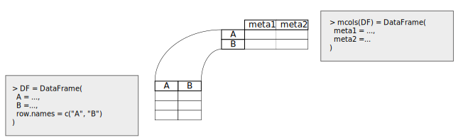

::::::::::::::::::::::::::::::::::::::: objectives

- Explain what S4 classes, generics, and methods are.
- Identify S4 classes at the core of the Bioconductor package infrastructure.
- Create various S4 objects and apply relevant S4 methods.

::::::::::::::::::::::::::::::::::::::::::::::::::

:::::::::::::::::::::::::::::::::::::::: questions

- What is the S4 class system?
- How does Bioconductor use S4 classes?
- How is the Bioconductor `DataFrame` different from the base `data.frame`?

::::::::::::::::::::::::::::::::::::::::::::::::::

## Install packages

Before we can proceed into the following sections, we install some Bioconductor packages that we will need.
First, we check that the *[BiocManager](https://bioconductor.org/packages/3.16/BiocManager)* package is installed before trying to use it; otherwise we install it.
Then we use the `BiocManager::install()` function to install the necessary packages.


```r
if (!requireNamespace("BiocManager", quietly = TRUE))
    install.packages("BiocManager")

BiocManager::install("S4Vectors")
```

::::::::::::::::::::::::::::::::::::::::::  prereq

### For Instructors

The first part of this episode may look somewhat heavy on the theory.
Do not be tempted to go into excessive details about the inner workings of the S4 class system (e.g., no need to mention the function `new()`, or to demonstrate a concrete example of code creating a class).
Instead, the caption of the first figure demonstrates how to progressively talk through the figure, introducing technical terms in simple sentences, building up to the method dispatch concept that is core to the S4 class system, and the source of much confusion in novice users.


::::::::::::::::::::::::::::::::::::::::::::::::::

## S4 classes and methods

### The methods package

The S4 class system is implemented in the base package [methods][r-package-methods].
As such, the concept is not specific to the Bioconductor project and can be found in various independent packages as well.
The subject is thoroughly documented in the online book [Advanced R][book-advanced-r-s4], by Hadley Wickham.
Most Bioconductor users will never need to get overly familiar with the intricacies of the S4 class system.
Rather, the key to an efficient use of packages in the Bioconductor project relies on a sufficient understanding of  key motivations for using the S4 class system, as well as best practices for user-facing functionality, including classes, generics, and methods.
In the following sections of this episode, we focus on the essential functionality and user experience of S4 classes and methods in the context of the Bioconductor project.

On one side, [S4 classes][glossary-s4-class] provide data structures capable of storing arbitrarily complex information in computational objects that can be assigned to variable names in an R session.
On the other side, [S4 generics and methods][glossary-s4-method] define functions that may be applied to process those objects.

Over the years, the Bioconductor project has used the S4 class system to develop a number of classes and methods capable of storing and processing data for most biological assays, including raw and processed assay data, experimental metadata for individual features and samples, as well as other assay-specific information as relevant.
Gaining familiarity with the standard S4 classes commonly used throughout Bioconductor packages is a key step in building up confidence in users wishing to follow best practices while developing analytical workflows.

{alt='S4 classes, generics, and methods.'}

**S4 classes, generics, and methods.**
On the left, two example classes named `S4Class1` and `S4Class2` demonstrate the concept of inheritance.
The class `S4Class1` contains two slots named `SlotName1` and `SlotName2` for storing data.
Those two slots are restricted to store objects of type `SlotType1` and `SlotType2`, respectively.
The class also defines validity rules that check the integrity of data each time an object is updated.
The class `S4Class2` inherits all the slots and validity rules from the class `S4Class1`, in addition to defining a new slot named `SlotName3` and new validity rules.
Example code illustrates how objects of each class are typically created using constructor functions named identically to the corresponding class.
On the right, one generic function and two methods demonstrate the concept of polymorphism and the process of S4 method dispatch.
The generic function `S4Generic1()` defines the name of the function, as well as its arguments.
However, it does not provide any implementation of that function.
Instead, two methods are defined, each providing a distinct implementation of the generic function for a particular class of input.
Namely, the first method defines an implementation of `S4Generic1()` if an object of class `S4Class1` is given as argument `x`, while the second method method provides a different implementation of `S4Generic1()` if an object of class `S4Class2` is given as argument `x`.
When the generic function `S4Generic1()` is called, a process called [method dispatch][glossary-s4-dispatch] takes place, whereby the appropriate implementation of the `S4Generic1()` method is called according to the class of the object passed to the argument `x`.

### Slots and validity

In contrast to the S3 class system available directly in base R (not described in this lesson), the S4 class system provides a much stricter definition of classes and methods for object-oriented programming (OOP) in R.
Like many programming languages that implement the OOP model, S4 classes are used to represent real-world entities as computational objects that store information inside one or more internal components called *slots*.
The class definition declares the type of data that may be stored in each slot; an error will be thrown if one would attempt to store unsuitable data.
Moreover, the class definition can also include code that checks the validity of data stored in an object, beyond their type.
For instance, while a slot of type `numeric` could be used to store a person's age, but a validity method could check that the value stored is, in fact, positive.

### Inheritance

One of the core pillars of the OOP model is the possibility to develop new classes that inherit and extend the functionality of existing classes.
The S4 class system implements this paradigm.

The definition of a new S4 classes can declare the name of other classes to inherit from.
The new classes will contain all the slots of the parent class, in addition to any new slot added in the definition of the new class itself.

The new class definition can also define new validity checks, which are added to any validity check implement in each of the parent classes.

### Generics and methods

While classes define the data structures that store information, generics and methods define the functions that can be applied to objects instantiated from those classes.

S4 generic functions are used to declare the name of functions that are expected to behave differently depending on the class of objects that are given as some of their essential arguments.
Instead, S4 methods are used define the distinct implementations of a generic function for each particular combination of inputs.

When a generic function is called and given an S4 object, a process called [method dispatch][glossary-s4-dispatch] takes place, whereby the class of the object is used to determine the appropriate method to execute.

## The S4Vectors package

The *[S4Vectors](https://bioconductor.org/packages/3.16/S4Vectors)* package defines the `Vector` and `List` virtual classes and a set of generic functions that extend the semantic of ordinary vectors and lists in R.
Using the S4 class system, package developers can easily implement vector-like or list-like objects as concrete subclasses of `Vector` or `List`.

Virtual classes -- such as `Vector` and `List` -- cannot be instantiated into objects themselves.
Instead, those virtual classes provide core functionality inherited by all the concrete classes that are derived from them.

Instead, a few low-level concrete subclasses of general interest (e.g. `DataFrame`, `Rle`, and `Hits`) are implemented in the *[S4Vectors](https://bioconductor.org/packages/3.16/S4Vectors)* package itself, and many more are implemented in other packages throughout the Bioconductor project (e.g., *[IRanges](https://bioconductor.org/packages/3.16/IRanges)*).

Attach the package to the current R session as follows.


```r
library(S4Vectors)
```

```{.output}
Loading required package: stats4
```

```{.output}
Loading required package: BiocGenerics
```

```{.output}

Attaching package: 'BiocGenerics'
```

```{.output}
The following objects are masked from 'package:stats':

    IQR, mad, sd, var, xtabs
```

```{.output}
The following objects are masked from 'package:base':

    anyDuplicated, aperm, append, as.data.frame, basename, cbind, colnames, dirname, do.call, duplicated,
    eval, evalq, Filter, Find, get, grep, grepl, intersect, is.unsorted, lapply, Map, mapply, match, mget,
    order, paste, pmax, pmax.int, pmin, pmin.int, Position, rank, rbind, Reduce, rownames, sapply, setdiff,
    sort, table, tapply, union, unique, unsplit, which.max, which.min
```

```{.output}

Attaching package: 'S4Vectors'
```

```{.output}
The following objects are masked from 'package:base':

    expand.grid, I, unname
```

:::::::::::::::::::::::::::::::::::::::::  callout

### Note

The package startup messages printed in the console are worth noting that the *[S4Vectors](https://bioconductor.org/packages/3.16/S4Vectors)* package masks a number of functions from the [base][r-package-base] package when the package is attached to the session.
This means that the *[S4Vectors](https://bioconductor.org/packages/3.16/S4Vectors)* package includes an implementation of those functions, and that -- being the latest package attached to the R session -- its own implementation of those functions will be found first on the R search path and used instead of their original implementation in the [base][r-package-base] package.

In many cases, masked functions can be used as before without any issue.
Occasionally, it may be necessary to disambiguate calls to masked function using the package name as well as the function name, e.g. `base::anyDuplicated()`.


::::::::::::::::::::::::::::::::::::::::::::::::::

## The DataFrame class

### An extension to the concept of rectangular data

The `DataFrame` class implemented in the *[S4Vectors](https://bioconductor.org/packages/3.16/S4Vectors)* package extends the concept of rectangular data familiar to users of the `data.frame` class in base R, or `tibble` in the tidyverse.
Specifically, the `DataFrame` supports the storage of any type of object (with `length` and `[` methods) as columns.

On the whole, the `DataFrame` class provides a formal definition of an S4 class that behaves very similarly to `data.frame`, in terms of construction, subsetting, splitting, combining, etc.

The `DataFrame()` constructor function should be used to create new objects, comparably to the `data.frame()` equivalent in base R.
The help page for the function, accessible as `?DataFrame`, can be consulted for more information.


```r
DF1 <- DataFrame(
    Integers = c(1L, 2L, 3L),
    Letters = c("A", "B", "C"),
    Floats = c(1.2, 2.3, 3.4)
)
DF1
```

```{.output}
DataFrame with 3 rows and 3 columns
   Integers     Letters    Floats
  <integer> <character> <numeric>
1         1           A       1.2
2         2           B       2.3
3         3           C       3.4
```

In fact, `DataFrame` objects can be easily converted to  equivalent `data.frame` objects.


```r
df1 <- as.data.frame(DF1)
df1
```

```{.output}
  Integers Letters Floats
1        1       A    1.2
2        2       B    2.3
3        3       C    3.4
```

Vice versa, we can also convert `data.frame` objects to `DataFrame` using the `as()` function.


```r
as(df1, "DataFrame")
```

```{.output}
DataFrame with 3 rows and 3 columns
   Integers     Letters    Floats
  <integer> <character> <numeric>
1         1           A       1.2
2         2           B       2.3
3         3           C       3.4
```

### Differences with the base data.frame

The most notable exceptions have to do with handling of row names.
First, row names are optional. This means calling `rownames(x)` will return `NULL` if there are no row names.


```r
rownames(DF1)
```

```{.output}
NULL
```

This is different from `data.frame`, where `rownames(x)` returns the equivalent of `as.character(seq_len(nrow(x)))`.


```r
rownames(df1)
```

```{.output}
[1] "1" "2" "3"
```

However, returning `NULL` informs, for example, combination functions that no row names are desired (they are often a luxury when dealing with large data).

Furthermore, row names of `DataFrame` objects are not required to be unique, in contrast to the `data.frame` in base R.
Row names are a frequent source of controversy in R, as they can be used to uniquely identify and index observations in rectangular format, without storing that information explicitly in a dedicated column.
When set, row names can be used to subset rectangular data using the `[` operator.
Meanwhile, non-unique row names defeat that purpose and can lead to unexpected results, as only the first occurrence of each selected row name is extracted.
Instead, the tidyverse `tibble` removed the ability to set row names altogether, forcing users to store every bit of information explicitly in dedicated columns, while providing functions to dedicated to efficiently filtering rows in rectangular data, without the need for the `[` operator.


```r
DF2 <- DataFrame(
    Integers = c(1L, 2L, 3L),
    Letters = c("A", "B", "C"),
    Floats = c(1.2, 2.3, 3.4),
    row.names = c("name1", "name1", "name2")
)
DF2
```

```{.output}
DataFrame with 3 rows and 3 columns
       Integers     Letters    Floats
      <integer> <character> <numeric>
name1         1           A       1.2
name1         2           B       2.3
name2         3           C       3.4
```

:::::::::::::::::::::::::::::::::::::::  challenge

### Challenge

Using the example above, what does `DF2["name1", ]` return? Why?

:::::::::::::::  solution

### Solution

```
> DF2["name1", ]
DataFrame with 1 row and 3 columns
       Integers     Letters    Floats
      <integer> <character> <numeric>
name1         1           A       1.2
```

Only the first occurrence of a row matching the row name `name1` is returned.

In this case, row names do not have a particular meaning, making it difficult to justify the need for them.
Instead, users could extract all the rows that matching the row name `name1` more explicitly as follows: `DF2[rownames(DF2) == "name1", ]`.

Users should be mindful of the motivation for using row names in any given situation; what they represent, and how they should be used during the analysis.


:::::::::::::::::::::::::

::::::::::::::::::::::::::::::::::::::::::::::::::

Finally, row names in `DataFrame` do not support partial matching during subsetting, in contrast to `data.frame`.
The stricter behaviour of `DataFrame` prevents often unexpected results faced by unsuspecting users.


```r
DF3 <- DataFrame(
    Integers = c(1L, 2L, 3L),
    Letters = c("A", "B", "C"),
    Floats = c(1.2, 2.3, 3.4),
    row.names = c("alpha", "beta", "gamma")
)
df3 <- as.data.frame(DF3)
```

:::::::::::::::::::::::::::::::::::::::  challenge

### Challenge

Using the examples above, what are the outputs of `DF3["a", ]` and `df3["a", ]`?
Why are they different?

:::::::::::::::  solution

### Solution

```
> DF3["a", ]
DataFrame with 1 row and 3 columns
      Integers     Letters    Floats
     <integer> <character> <numeric>
<NA>        NA          NA        NA
> df3["a", ]
      Integers Letters Floats
alpha        1       A    1.2
```

The `DataFrame` object did not perform partial row name matching, and thus did not match any row and return a `DataFrame` full of `NA` values.
Instead, the `data.frame` object performed partial row name matching, matched the requested `"a"` to the `"alpha"` row name, and returned the corresponding row as a new `data.frame` object.


:::::::::::::::::::::::::

::::::::::::::::::::::::::::::::::::::::::::::::::

### Indexing

Just like a regular `data.frame`, columns can be accessed using `$`, `[`, and `[[`.
Each operator has a different purpose, and the most appropriate one will often depend on what you are trying to achieve.

For example, the dollar operator `$` can be used to extract a single column by name.
That will often be a vector, but it may depend on the nature of the data in that column.
This operator can be quite convenient in an interactive R session, as it will offer autocompletion among available column names.


```r
DF3$Integers
```

```{.output}
[1] 1 2 3
```

Similarly, the double bracket operator `[[` can also be used to extract a single column.
It is more flexible that `$` as it can handle both character names and integer indices.


```r
DF3[["Letters"]]
```

```{.output}
[1] "A" "B" "C"
```

```r
DF3[[2]]
```

```{.output}
[1] "A" "B" "C"
```

The operator `[` is most convenient when it comes to selecting simultaneously on rows and columns, or controlling whether a single-column selection should be returned as a `DataFrame` or a `vector`.


```r
DF3[2:3, "Letters", drop=FALSE]
```

```{.output}
DataFrame with 2 rows and 1 column
          Letters
      <character>
beta            B
gamma           C
```

### Metadata columns

One of most notable novel functionality in `DataFrame` relative to the base `data.frame` is the capacity to hold metadata on the columns in another `DataFrame`.

{alt='Metadata columns.'}

**Metadata columns.**
Metadata columns are illustrated in the context of a `DataFrame` object.
On the left, a `DataFrame` object called `DF` is created with columns named `A` and `B`.
On the right, the metadata columns for `DF` are accessed using `mcols(DF)`.
In this example, two metadata columns are created with names `meta1` and `meta2`.
Metadata columns are stored as a `DataFrame` that contains one row for each column in the parent `DataFrame`.

The metadata columns are accessed using the function `mcols()`,
If no metadata column is defined, `mcols()` simply returns `NULL.`


```r
DF4 <- DataFrame(
    Integers = c(1L, 2L, 3L),
    Letters = c("A", "B", "C"),
    Floats = c(1.2, 2.3, 3.4),
    row.names = c("alpha", "beta", "gamma")
)
mcols(DF4)
```

```{.output}
NULL
```

The function `mcols()` can also be used to add, edit, or remove metadata columns.
For instance, we can initialise metadata columns as a `DataFrame` of two columns:

- one column indicating the type of value stored in the corresponding column
- one column indicating the number of distinct values observed in the corresponding column


```r
mcols(DF4) <- DataFrame(
    Type = sapply(DF4, typeof),
    Distinct = sapply(DF4, function(x) { length(unique(x)) } )
)
mcols(DF4)
```

```{.output}
DataFrame with 3 rows and 2 columns
                Type  Distinct
         <character> <integer>
Integers     integer         3
Letters    character         3
Floats        double         3
```

:::::::::::::::::::::::::::::::::::::::::  callout

### Note

The row names of the metadata columns are automatically set to match the column names of the parent `DataFrame`, clearly indicating the pairing between columns and metadata.


::::::::::::::::::::::::::::::::::::::::::::::::::

## Run-length encoding (RLE)

### An extension to the concept of vector

Similarly to the `DataFrame` class implemented in the *[S4Vectors](https://bioconductor.org/packages/3.16/S4Vectors)*,
the `Rle` class provides an S4 extension to the `rle()` function from the base package.
Specifically, the `Rle` class supports the storage of atomic vectors in a run-length encoding format.

{alt='Run-length encoding.'}

**Run-length encoding.**
The concept of run-length encoding is demonstrated here using the example of a sequence of nucleic acids.
Before encoding, each nucleotide at each position in the sequence is explicitly stored in memory.
During the encoding, consecutive runs of identical nucleotides are collapsed into two bits of information: the identity of the nucleotide and the length of the run.

Run-length encoding can dramatically reduce the memory footprint of vectors that contain frequent runs of identical information.
For instance, a compelling application of run-length encoding is the representation of genomic coverage in sequencing experiments, where large genomic regions devoid of any mapped reads result in long runs of `0` values.
Storing each individual value would be highly inefficient from the standpoint of memory usage.
Instead, the run-length encoding process collapses such runs of redundant information from arbitrarily long runs of identical information to two values: the repeated value itself, and the number of times that it is repeated.


```r
v1 <- c(0, 0, 0, 0, 0, 0, 0, 1, 2, 3, 2, 1, 0, 0, 0, 0, 0)
rle1 <- Rle(v1)
rle1
```

```{.output}
numeric-Rle of length 17 with 7 runs
  Lengths: 7 1 1 1 1 1 5
  Values : 0 1 2 3 2 1 0
```

### Indexing

Just like a regular `vector`, `Rle` objects can be indexed using `[`.


```r
rle1[2:4]
```

```{.output}
numeric-Rle of length 3 with 1 run
  Lengths: 3
  Values : 0
```

### Usage

As vector-like objects, `Rle` objects can also be stored as columns of `DataFrame` objects, alongside other vector-like objects.


```r
v2 <- c(rep(1, 5), rep(2, 5))
rle2 <- Rle(v2)
DF5 <- DataFrame(
    vector = v2,
    rle = rle2,
    equal = v2 == rle2
)
DF5
```

```{.output}
DataFrame with 10 rows and 3 columns
      vector   rle equal
   <numeric> <Rle> <Rle>
1          1     1  TRUE
2          1     1  TRUE
3          1     1  TRUE
4          1     1  TRUE
5          1     1  TRUE
6          2     2  TRUE
7          2     2  TRUE
8          2     2  TRUE
9          2     2  TRUE
10         2     2  TRUE
```

:::::::::::::::::::::::::::::::::::::::::  callout

### Going further

A number of standard operations with `Rle` objects are documented in the help page of the `Rle` class, accessible as `?Rle`, and in the vignettes of the *[S4Vectors](https://bioconductor.org/packages/3.16/S4Vectors)* package, accessible using `browseVignettes("S4Vectors")`.


::::::::::::::::::::::::::::::::::::::::::::::::::

[r-package-methods]: https://stat.ethz.ch/R-manual/R-devel/library/methods/html/00Index.html
[book-advanced-r-s4]: https://adv-r.had.co.nz/S4.html
[glossary-s4-class]: reference.html#s4-class
[glossary-s4-method]: reference.html#s4-method
[glossary-s4-dispatch]: reference.html#s4-method-dispatch
[r-package-base]: https://stat.ethz.ch/R-manual/R-devel/library/base/html/00Index.html


:::::::::::::::::::::::::::::::::::::::: keypoints

- S4 classes store information in slots, and check the validity of the information every an object is updated.
- To ensure the continued integrity of S4 objects, users should not access slots directly, but using dedicated functions.
- S4 generics invoke different implementations of the method depending on the class of the object that they are given.
- The S4 class `DataFrame` extends the functionality of base `data.frame`, for instance with the capacity to hold information about each column in metadata columns.
- The S4 class `Rle` extends the functionality of the base `vector`, for instance with the capacity to encode repetitive vectors in a memory-efficient format.

::::::::::::::::::::::::::::::::::::::::::::::::::


