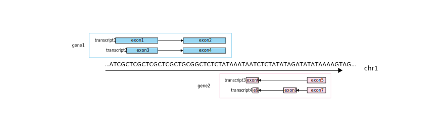

```{r, echo=FALSE, purl=FALSE, message=FALSE}
source("download_data.R")
```

```{r, include=FALSE}
source("../bin/chunk-options.R")
knitr_fig_path("07-")
options(width = 120)
```

```{r, include=FALSE}
options(htmltools.dir.version = FALSE)
library(RefManageR)
library(bibtex)
bib <- ReadBib("../bibliography.bib")
BibOptions(
  longnamesfirst = FALSE,
  check.entries = FALSE,
  bib.style = "authoryear",
  cite.style = "authoryear",
  max.names = 1,
  style = "html",
  hyperlink = "to.bib",
  dashed = TRUE)
```

# Install packages

Before we can proceed into the following sections, we install some Bioconductor packages that we will need.
First, we check that the `r BiocStyle::Biocpkg("BiocManager")` package is installed before trying to use it; otherwise we install it.
Then we use the `BiocManager::install()` function to install the necessary packages.

```{r, message=FALSE, warning=FALSE}
if (!requireNamespace("BiocManager", quietly = TRUE))
    install.packages("BiocManager")

BiocManager::install("GenomicRanges")
```


# The GenomicRanges package and classes

## Why do we need classes for genomic ranges?

In the era of genomics, many observations are reported as ranges of
coordinates - i.e., intervals - on a genomic scale.
Depending on the nature of the assay, those genomic ranges may represent genes,
transcripts, exons, single nucleotide polymorphisms (SNPs), transcription factor
binding sites, or peaks from next-generation sequencing assays such as ChIP-seq
or ATAC-seq.

Genomic ranges tie those observations of assayed values (e.g., gene
expression) to a physical location in the genome or an organism.
For instance, those genomic ranges can be used to query physical proximity or
overlap between assayed features and databases of known regulatory regions.

Often, the final genomic ranges used for reporting measurements are the result
of combinations and operations on sets of genomic ranges in databases of
known genomic features.
For instance, in RNA-sequencing, next-generation sequencing reads are often
counted within individual exons, and those counts are subsequently aggregated
across all the exons of each gene.
Separately, promoters are frequently defined as region of arbitrary width,
partly upstream and/or downstream of known transcription start sites (TSS).

Importantly, genomic ranges do not necessarily need to span multiple
coordinates.
The notion of range is meant in the mathematical way, and single-nucleotide
genomic ranges (e.g., SNPs) can be described as opening and closing at the same
coordinate (or at the next coordinate, in the case of a right-open interval).

For many organisms, the genetic material is split into a number of separate
nucleic acid molecules (e.g., chromosomes, plasmids).
As such, genomic ranges are described by the name of the sequence and
the numeric interval of coordinates on that sequence.


**Example uses of the GenomicRanges algebra.**
Adapted from `r Citet(bib, "Huber2015")`.
The figure illustrates the example of a gene model that comprises two
transcripts, and the definition of various genomic ranges relative to that
gene model.
For instance - in this specific illustration - unspliced transcripts summarise
the entire range of coordinates from the start of the first exon to the end of
the last exon; while the gene region is defined as the set of coordinates
included in at least one exon of one transcript.

## A brief introduction to intervals

Intervals are described in mathematical terms using a start and an end position
on an axis of continuous coordinates.
The interval then comprises all the real numbers between those two coordinates,
and the width of each interval can be computed from the difference between the
coordinates of the start and end positions.

Generally speaking, the start and end position can be any rational number,
including floating-point numbers.
However, in genomics, integer coordinates are typically used to represent the
location of monomers (e.g., nucleotide, amino acid) in the sequence of polymers
(e.g., nucleic acid, protein).

You may come across packages, databases, and programming languages that use
different rules to define intervals.
In R, indexing is 1-based (meaning that the first position in a sequence is
1), which contrasts with Python that is 0-based (the index of the first
position in a sequence is 0).
Similarly, references files in the UCSC Genome Browser are 0-based, while
those of the Ensembl Genome Browser are 1-based.

The definition of intervals in a shared coordinate system allows calculations
such as the distance between two intervals - generally calculated as the
distance between the two closest edges of those intervals -, and the
identification of overlapping intervals.


**Example of intervals.**
Three intervals named A, B, and C, are represented.
Interval A starts at position 5 and ends at position 9, for a width of 4 units;
interval B starts at position 1 and ends at position 3, for a width of 2 units;
interval C starts at position 3 and ends at position 6, for a width of 3 units.
Intervals A and C overlap, from coordinates 5 to 6;
while intervals B and C meet at coordinate 3, but do not strictly overlap each
other.

## A brief introduction to genomic ranges

Genomic ranges essentially extend the notion of mathematical intervals on
sets of biological sequences (e.g., chromosomes).
In other words, genomic ranges combine the name of the biological sequence on
which they are located with the integer range of coordinates that the
genomic ranges span in that sequence.
This is key to distinguish genomic features that span an overlapping range of
coordinates on different biological sequences.

Furthermore, the double-stranded nature of DNA sequences also adds the notion of
strandedness to genomic ranges.
If known, the strand information of genomic features is a key piece of
information that should be tracked, so that it may be used for downstream
analyses.
For instance, genomic ranges spanning a common range of coordinates on opposite
strands of the same DNA sequence may not be considered to overlap (e.g., for the
purpose of strand-specific next-generation sequencing assays).

Genomic ranges are _closed_ intervals - the start and end positions are included
in the interval; in the example of nucleic acids, the start position indicates
the first nucleotide in the interval, and the end position indicates the last
nucleotide in the interval.



**Example of genomic ranges.**
Genomic ranges are defined by the name of the biological sequence in which they
are located (here, "chr1"), and the positions of start and end in that sequence.
Here, numeric positions are not explicitly shown, but implied by the sequence of
nucleic acids and the arrow indicating coordinates increasing from the left to
the right.
In this example, genomic ranges can be used to describe individual exons,
with metadata grouping those exons into transcripts and genes.
Furthermore, the strandedness of exons, transcripts, and genes is an important
piece of information to precisely describe the location of each genomic range
in the double-stranded DNA polymer.

# The GenomicRanges package

## Overview

The `r BiocStyle::Biocpkg("GenomicRanges")` package implements
[S4 classes][glossary-s4-class] to represent genomic ranges as S4 objects.

Specifically, the `GRanges` class is designed to store a set of intervals
including the name of the sequence where features are located as well as the
range of integer coordinates spanned by the feature in that sequence.

More generally, the `IRanges` class is designed to store a set of intervals
over a range of integer coordinates, without the notion of sequence names.
As such, a `GRanges` object is merely the combination of an `IRanges` object and
a vector of sequence names.

Those S4 classes provide automatic validity-checking functionality,
and a range of methods implementing common operations on integer intervals
and genomic ranges,
from the calculation of distance between pairs of intervals to the
identification of overlapping genomic ranges.

A short presentation of the basic classes defined in the
`r BiocStyle::Biocpkg("GenomicRanges")` package is available in one of the
package vignettes, accessible as `vignette("GenomicRangesIntroduction")`,
while more detailed information is provided in the other package vignettes,
accessible as `browseVignettes("GenomicRanges")`.

## First steps

To get started, we load the package.

```{r, message=FALSE, warning=FALSE}
library(GenomicRanges)
```

## The IRanges class

While the genomic space of many organisms is subdivided into multiple sequences
(e.g., chromosomes), many operations on genomic ranges take place within
individual sequences, where only integer positions matter.
The `IRanges` class provides a container for such "simple" ranges that are
defined by two out of three pieces of information:

- the start position of the range
- the width of the range
- the end position of the range

The `IRanges()` constructor function accepts those three pieces of information
in the arguments `start=`, `width=`, and `end=`.
For instance, we create two integer ranges from their start position and width:

- one range starts at position 10 and has width 10
- one range starts at position 15 and has width 5

```{r}
demo_iranges <- IRanges(start = c(10, 15), width = c(10, 5))
demo_iranges
```

We note how the object displays not only the _start_ and _width_ information
that we requested for each range, but also the _end_ position that is naturally
computed from the other two pieces of information.

> ## Challenge
> 
> Create the same two ranges as above, using the arguments `start=` and `end=`
> of the `IRanges()` constructor function.
> 
> > ## Solution
> > 
> > ```{r}
> > IRanges(start = c(10, 15), end = c(19, 19))
> > ```
> > 
> {: .solution}
{: .challenge}

The start and end positions as well as the width of every interval can be
extracted as numeric vector using the functions `start()`, `end()` and
`width()`, respectively.

```{r}
start(demo_iranges)
end(demo_iranges)
width(demo_iranges)
```

Objects of the `IRanges` family extend the `Vector` class, and are handled as
unidimensional vectors in terms of indexing.
As such, individual ranges can be extracted by integer index like any
regular vector.

```{r}
demo_iranges[1]
```

## Metadata on IRanges

The `IRanges` class can accommodate metadata information on each range,
including names - passed to the `names=` argument - and miscellaneous metadata
passed as named vectors.

For instance, we create two ranges named "A" and "B".
Furthermore, we define metadata fields to store an example of character
values and numeric values, respectively.
Both the names and the values of the metadata fields are completely arbitrary
in this example.

```{r}
demo_with_metadata <- IRanges(
  start = c(10,  15),
  end   = c(19,  19),
  names = c("A", "B"),
  character_metadata = c("control", "target"),
  numeric_metadata = c(100, 200)
)
demo_with_metadata
```

The metadata columns can be extracted as a `DataFrame` using the function `mcols()`, as is "metadata columns".

```{r}
mcols(demo_with_metadata)
```

The character vector of names can be extracted using the function `names()`.

```{r}
names(demo_with_metadata)
```

Similarly to named vector of base data types, individual ranges can be extracted
by name.

```{r}
demo_with_metadata["A"]
```

## Operations on IRanges

`IRanges` provide the basis for most operations on ranges of numerical coordinates.

For instance, given two set of ranges - a query set and a subject set - the
`findOVerlaps()` function can be used to find out which pairs of ranges in the
two sets overlap with each other.

```{r}
query_iranges <- IRanges(
  start = c(8, 16),
  end   = c(14, 18)
)
overlaps_iranges <- findOverlaps(query = query_iranges, subject = demo_iranges)
overlaps_iranges
```

The results are returned in the form of a `Hits` object, which we has not
introduced yet.
A `Hits` object is visualised as a table that comprises two integer
columns named `queryHits` and `subjectHits`.
Each row in the table reports an overlap between one range in the query set
and one range in the subject set, with the integer value in each column
indicating the index of the range in each set involved in the overlap.

In this example, we confirm that the first range in the query set overlaps the
first range in the subject set; while the second range in the query set overlaps
both ranges in the subject set.

> ## Going further
> 
> For downstream use, the two components can be extracted from `Hits` objects
> using their names, respectively:
> 
> ```{r}
> queryHits(overlaps_iranges)
> subjectHits(overlaps_iranges)
> ```
>
> While displayed as a table, `Hits` objects are actually handled like vectors.
> Individual hits between one query range and one subject range can be extracted
> their index:
> 
> ```{r}
> overlaps_iranges[1]
> ```
> 
{: .callout}

## The GRanges class

Having defined integer ranges, the only additional information necessary to
define genomic ranges is the name the genomic sequence on which each range is
located.

For instance, we define two genomic ranges, as follows:

- one genomic range on chromosome 1 (abbreviated "chr1"), from position 10 to 25
- one genomic range on chromosome 2 (abbreviated "chr2"), from position 20 to 35

To do so, we use the `GRanges()` constructor function.
We provide the sequence names as a character vector to the argument `seqnames=`,
and we provide both the start and end position to the argument `ranges=`
as an `IRanges` object.

```{r}
demo_granges <- GRanges(
  seqnames = c("chr1", "chr2"),
  ranges = IRanges(
    start = c(10, 20),
    end   = c(25, 35))
)
demo_granges
```

In the console, the object displays the sequence names in the `seqnames`
component, and the ranges in the form `start-end` in the `ranges` component.
Furthermore, the example above also demonstrate that `GRanges` objects possess a
component called `strand`; the symbol `*` indicates unstranded genomic ranges,
as we have not provided that information.

The strand information can be supplied to the `strand=` argument, for instance:

```{r}
demo_granges2 <- GRanges(
  seqnames = c("chr1", "chr2"),
  ranges = IRanges(
    start = c(10, 20),
    end   = c(25, 35)),
  strand  = c("+", "-")
)
demo_granges2
```

Finally, the examples above also demonstrate that `GRanges` objects include a
component called `seqinfo`, which is occasionally used to store information
about each sequence that may be represented in the `seqnames` component.
In the latest example above, we have not provide any information about any
sequence.
As such, the `seqinfo` component was automatically populated with the names
of the sequences that we used to create the object, while the remaining
pieces of information were left unspecified, as `NA`.

```{r}
seqinfo(demo_granges2)
```

The example above reveals that information about sequences include not only
their respective name and length, but also whether they represent a circular
polymer (e.g., plasmid), and the name of the genome that they are part of.

This information can be provided directly to the constructor when the object
is created, or edited on an existing object using the `seqinfo()` accessor and
the `Seqinfo()` constructor:

```{r}
seqinfo(demo_granges2) <-  Seqinfo(
    seqnames = c("chr1", "chr2"),
    seqlengths = c(1234, 5678),
    isCircular = c(FALSE, TRUE),
    genome = c("homo_sapiens", "homo_sapiens")
)
demo_granges2
```

## Metadata on GRanges

Similarly to `IRanges`, metadata can be passed directly to the `GRanges`
constructor function.
For instance:

```{r}
demo_granges3 <- GRanges(
  seqnames = c("chr1", "chr2"),
  ranges = IRanges(
    start = c(10, 20),
    end = c(25, 35)),
  metadata1 = c("control", "target"),
  metadata2 = c(1, 2)
)
demo_granges3
```

## Importing genomic ranges from files

Frequently, large collections of genomic ranges are imported from files rather
than described in manually written code.
In particular, genome-wide annotations of known gene features are distributed
as files on websites such as the [Ensembl FTP][ensembl-ftp] and the
[UCSC Genome Data][ucsc-genome-data] sites.

Various file formats are commonly used to store genomic ranges in bioinformatics
workflows.
For instance, the BED (Browser Extensible Data) format is commonly found in
Chromatin Immunoprecipitation Sequencing (ChIP-Seq), while GTF
(Gene Transfer Format, GTF2.2) is the _de facto_ standard file format to
describe genomic features such as exons, transcripts, and genes.

In the following example, we import the gene model for Actin Beta (ACTB) from
a small GTF file as a set of genomic ranges.
The example file represents a subset of a GTF file for the _Homo sapiens_ 
species, downloaded from the [Ensembl FTP][ensembl-ftp] site.
The original file contains more than 3 millions lines and 22 metadata fields,
from which a subset was extracted into a smaller file for this lesson.

In particular, we use the `import()` generic
defined in the `r BiocStyle::Biocpkg("BiocIO")` package - with methods
implemented in the `r BiocStyle::Biocpkg("rtracklayer")` package - as a
versatile function that is capable of recognising common file extensions and
associating them with the appropriate method for parsing each particular file
format.

```{r}
library(rtracklayer)
actb_gtf_data <- rtracklayer::import("data/actb.gtf")
actb_gtf_data
```

> ## Going further
> 
> Individual methods for parsing specific file formats can be invoked directly.
> For instance, in this case, the GTF file format being identical to the GFF
> version 2 file format, we could have directly invoked the function
> `rtracklayer::import.gff2()` with the exact same effect.
>
> Refer to the documentation of the `r BiocStyle::Biocpkg("rtracklayer")`
> package for the full list of methods available.
{: .callout}

In the example above, the contents of the GTF file were imported into a
`GRanges` object. For each entry in the file, the sequence name, start and end
position, and strand information were used to populated the dedicated components
of the object, while all other pieces of information are stored as separate
columns of metadata.

From here on, this `GRanges` object can be manipulated just like any of the
other `GRanges` objects that we have created earlier in this episode.

## Operations on GRanges and the GRangesList class

As we have demonstrated so far, `GRanges` objects can be manually defined
or imported from files.
Those often represent genomic regions of interest, and databases of known
genomic features, respectively.
Either way, a number of operations are commonly applied to `GRanges` objects
throughout bioinformatics workflows.

### Subset

For instance, the `subset()` method is extremely convenient to extract a set
of genomic ranges matching a condition on any component, including sequence
name, start and end position, strand, or any metadata field.
In the example below, we extract all the records of type `transcript` that start
at position `5527147`.

```{r}
subset(actb_gtf_data, type == "transcript" & start == 5527147)
```

### Split

Separately, the `split()` method is useful to divide a set of genomic ranges
initially stored in a single `GRanges` object into groups that are stored
in a named list of `GRanges` objects.
Conveniently, the `GRangesList` class provides a container for efficiently
displaying and processing lists of `GRanges` objects.

In the example below, we first extract the subset of entries that represent
exons, before separating those exons by transcript identifier, yielding
the result as a `GRangesList` object.

```{r}
actb_exons <- subset(actb_gtf_data, type == "exon")
actb_exons_by_transcript <- split(actb_exons, actb_exons$transcript_id)
actb_exons_by_transcript
```

When printing the object above in the console, the first line confirms the
class of the object as `GRrangesList`, while each named `GRanges` in that list
is introduced by the dollar sign and the name of that item, just like regular
named lists in base R.

### Length

By nature, many of the methods applicable to `list` objects can be directly
applied to `GRangesList` objects.
For instance, the `lengths()` function can be used on `GRangesList` to display
the length of each `GRanges` object in the list as an integer vector.

In the latest example above, we can compute the number of exons in each transcript
as the length of each `GRanges` object within the `GRangesList`:

```{r}
lengths(actb_exons_by_transcript)
```

> ## Challenge
> 
> Importantly, the function `lengths()` (with a final `s`) demonstrated above
> is different from the function `length()` (without `s`).
> The former is meant to be used on list objects, while the latter is meant
> to be used on vectors.
> 
> What does `length(actb_exons_by_transcript)` return, and why?
> 
> > ## Solution
> > 
> > ```{r}
> > length(actb_exons_by_transcript)
> > ```
> > 
> > This code returns the single integer value `23`, which is the number
> > of `GRanges` in the `GRangesList` object and the number of transcripts for
> > the gene ACTB.
> > 
> {: .solution}
{: .challenge}

## Subset by overlap

Possibly one of the most common operations when working with genomic ranges
is to subset arbitrarily large collections of genomic ranges to those located
in a specific region of the genome; for instance, when visualising information
as tracks in a genome browser.

To demonstrate, we manually define a new `GRanges` representing a region of
interest that we will use to extract all of the genomic ranges imported earlier
from the GTF file which overlap that region of interest.

```{r}
region_of_interest <- GRanges(
    seqnames = "7",
    ranges = IRanges(start = 5525830, end = 5531239)
)
actb_in_region <- subsetByOverlaps(x = actb_gtf_data, ranges = region_of_interest)
actb_in_region
```

Like the `subset()` method, the `subsetByOverlaps()` method returns a new
`GRanges` object.
We can visually compare the information printed in the object
(256 ranges in the new subsetted object, relative to 267 ranges in the original
object), or we can programmatically compare the length of the two objects
to check whether the new `GRanges` object is any smaller than the original
`GRanges` object:

```{r}
length(actb_in_region) - length(actb_gtf_data)
```

In the example above, we learn that the new `GRanges` object has 11 records less
than the original `GRanges` object.

> ## Going further
> 
> Many more methods exist to operate on `GRanges` and `GRangesList` objects 
> that could be demonstrated here.
> 
> You can find the full list of functions defined in the `GenomicRanges` package
> on the index page of the package documentation, accessible using
> `help(package="GenomicRanges")`.
> You can also find more examples and use cases in the package vignettes, accessible using
> `browseVignettes("GenomicRanges")`.
>
{: .callout}

[glossary-s4-class]: ../reference.html#s4-class
[ensembl-ftp]: https://www.ensembl.org/info/data/ftp/
[ucsc-genome-data]: https://hgdownload.soe.ucsc.edu/downloads.html
