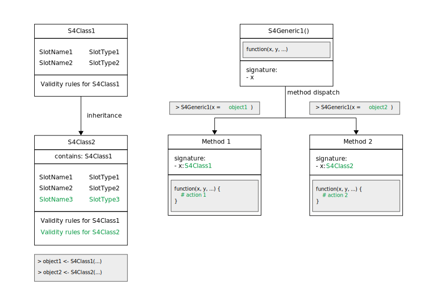

```{r, include=FALSE}
source("../bin/chunk-options.R")
knitr_fig_path("05-")
options(width = 120)
```

# Install packages

Before we can proceed into the following sections, we install some Bioconductor packages that we will need.

```{r, eval=FALSE}
BiocManager::install("S4Vectors")
```

# S4 classes and methods

## The methods package

The S4 class system is implemented in the base package [methods][r-package-methods].
As such, the concept is not specific to the Bioconductor project and can be found in various independent packages as well.
The subject is thoroughly documented in the online book [Advanced R by Hadley Wickham][book-advanced-r-s4].
In the following sections, we focus on the essential functionality and user perspective on S4 classes and methods.



## Slots and validity

In contrast to the S3 class system available directly in base R, the S4 class system provides a much stricter definition of classes and methods for object-oriented programming (OOP) in R.
Like many programming languages that implement the OOP model, S4 classes are used to represent real-world entities as computational objects that store information inside one or more internal components called _slots_.
The class definition declares the type of data that may be stored in each slot; an error will be thrown if one would attempt to store unsuitable data.
Moreover, the class definition can also include code that checks the validity of data stored in an object, beyond their type.
For instance, while a slot of type `numeric` could be used to store a person's age, but a validity method could check that the value stored is positive.

## Inheritance

One of the core pillars of the OOP model is the possibility to develop new classes that inherit and extend the functionality of existing classes.
The S4 class system implements this paradigm.

The definition of a new S4 classes can declare the name of other classes to inherit from.
The new classes will contain all the slots of the parent class, in addition to any new slot added in the definition of the new class itself.

The new class definition can also define new validity checks, which are added to any validity check implement in each of the parent classes.

## Generics and methods

While classes define the data structures that store information, generics and methods define the functions that can be applied to objects instantiated from those classes.

S4 generic functions are used to declare the name of functions that are expected to behave differently depending on the class of objects that are given as some of their essential arguments.
Instead, S4 methods are used define the distinct implementations of a generic function for each particular combination of inputs.

When a generic function is called and given an S4 object, a process called method dispatch takes place, whereby the class of the object is used to determine the appropriate method to execute.

# The S4Vectors package

The `r BiocStyle::Biocpkg("S4Vectors")` package defines the `Vector` and `List` virtual classes and a set of generic functions that extend the semantic of ordinary vectors and lists in R.
Using the S4 class system, package developers can easily implement vector-like or list-like objects as concrete subclasses of `Vector` or `List`.

Virtual classes -- such as `Vector` and `List` -- cannot be instantiated into objects themselves.
Instead, those virtual classes provide core functionality inherited by all the concrete classes that are derived from them.

Instead, a few low-level concrete subclasses of general interest (e.g. `DataFrame`, `Rle`, and `Hits`) are implemented in the `r BiocStyle::Biocpkg("S4Vectors")` package itself, and many more are implemented in other packages throughout the Bioconductor project (e.g., `r BiocStyle::Biocpkg("IRanges")`).

Attach the package to the current R session as follows.

```{r}
library(S4Vectors)
```

> Note 
>
> The package startup messages printed in the console are worth noting that the `r BiocStyle::Biocpkg("S4Vectors")` package masks a number of functions from the [base][r-package-base] package when the package is attached to the session.
> This means that the `r BiocStyle::Biocpkg("S4Vectors")` package includes an implementation of those functions, and that -- being the latest package attached to the R session -- its own implementation of those functions will be found first on the R search path and used instead of their original implementation in the [base][r-package-base] package.
> 
> In many cases, masked functions can be used as before without any issue.
> Occasionally, it may be necessary to disambiguate calls to masked function using the package name as well as the function name, e.g. `base::anyDuplicated()`.
{: .callout}

# The DataFrame class

The `DataFrame` class implemented in the `r BiocStyle::Biocpkg("S4Vectors")` package extends the concept of rectangular data familiar to users of the `data.frame` class in base R, or `tibble` in the tidyverse.
Specifically, the `DataFrame` supports the storage of any type of object (with `length` and `[` methods) as columns.

On the whole, the `DataFrame` class provides a formal definition of an S4 class that behaves very similarly to `data.frame`, in terms of construction, subsetting, splitting, combining, etc.

```{r}
DF1 <- DataFrame(
    Integers = c(1L, 2L, 3L),
    Letters = c("A", "B", "C"),
    Floats = c(1.2, 2.3, 3.4)
)
DF1
```

In fact, `DataFrame` objects can be easily converted to  equivalent `data.frame` objects.

```{r}
df1 <- as.data.frame(DF1)
df1
```

The most notable exceptions have to do with handling of row names.
First, row names are optional. This means calling `rownames(x)` will return `NULL` if there are no row names.

```{r}
rownames(DF1)
```

This is different from `data.frame`, where `rownames(x)` returns the equivalent of `as.character(seq_len(nrow(x)))`.

```{r}
rownames(df1)
```

However, returning `NULL` informs, for example, combination functions that no row names are desired (they are often a luxury when dealing with large data).

Furthermore, row names of `DataFrame` objects are not required to be unique, in contrast to the `data.frame` in base R.
Row names are a frequent source of controversy in R, as they can be used to uniquely identify and index observations in rectangular format, without storing that information explicitly in a dedicated column.
When set, row names can be used to subset rectangular data using the `[` operator.
Meanwhile, non-unique row names defeat that purpose and can lead to unexpected results, as only the first occurrence of each selected row name is extracted.
Instead, the tidyverse `tibble` removed the ability to set row names altogether, forcing users to store every bit of information explicitly in dedicated columns, while providing functions to dedicated to efficiently filtering rows in rectangular data, without the need for the `[` operator.

```{r}
DF2 <- DataFrame(
    Integers = c(1L, 2L, 3L),
    Letters = c("A", "B", "C"),
    Floats = c(1.2, 2.3, 3.4),
    row.names = c("name1", "name1", "name2")
)
DF2
```

> ## Challenge
> 
> Using the example above, what does `DF2["name1", ]` return? Why?
> 
> > ## Solution
> >
> > ``` 
> > > DF2["name1", ]
> > DataFrame with 1 row and 3 columns
> >        Integers     Letters    Floats
> >       <integer> <character> <numeric>
> > name1         1           A       1.2
> > ```
> >
> > Only the first occurrence of a row matching the row name `name1` is returned.
> > 
> > In this case, row names do not have a particular meaning, making it difficult to justify the need for them.
> > Instead, users could extract all the rows that matching the row name `name1` more explicitly as follows: `DF2[rownames(DF2) == "name1", ]`.
> > 
> > Users should be mindful of the motivation for using row names in any given situation; what they represent, and how they should be used during the analysis.
> {: .solution}
{: .callout}

Finally, row names in `DataFrame` do not support partial matching during subsetting, in contrast to `data.frame`.
The stricter behaviour of `DataFrame` prevents often unexpected results faced by unsuspecting users.

```{r}
DF3 <- DataFrame(
    Integers = c(1L, 2L, 3L),
    Letters = c("A", "B", "C"),
    Floats = c(1.2, 2.3, 3.4),
    row.names = c("alpha", "beta", "gamma")
)
df3 <- as.data.frame(DF3)
```

> ## Challenge
> 
> Using the examples above, what are the outputs of `DF3["a", ]` and `df3["a", ]`?
> Why are they different?
> 
> > ## Solution
> >
> > ``` 
> > > DF3["a", ]
> > DataFrame with 1 row and 3 columns
> >       Integers     Letters    Floats
> >      <integer> <character> <numeric>
> > <NA>        NA          NA        NA
> > > df3["a", ]
> >       Integers Letters Floats
> > alpha        1       A    1.2
> > ```
> >
> > The `DataFrame` object did not perform partial row name matching, and thus did not match any row and return a `DataFrame` full of `NA` values.
> > Instead, the `data.frame` object performed partial row name matching, matched the requested `"a"` to the `"alpha"` row name, and returned the corresponding row as a new `data.frame` object.
> {: .solution}
{: .callout}

[r-package-base]: https://stat.ethz.ch/R-manual/R-devel/library/base/html/00Index.html
[r-package-methods]: https://stat.ethz.ch/R-manual/R-devel/library/methods/html/00Index.html
[book-advanced-r-s4]: http://adv-r.had.co.nz/S4.html
